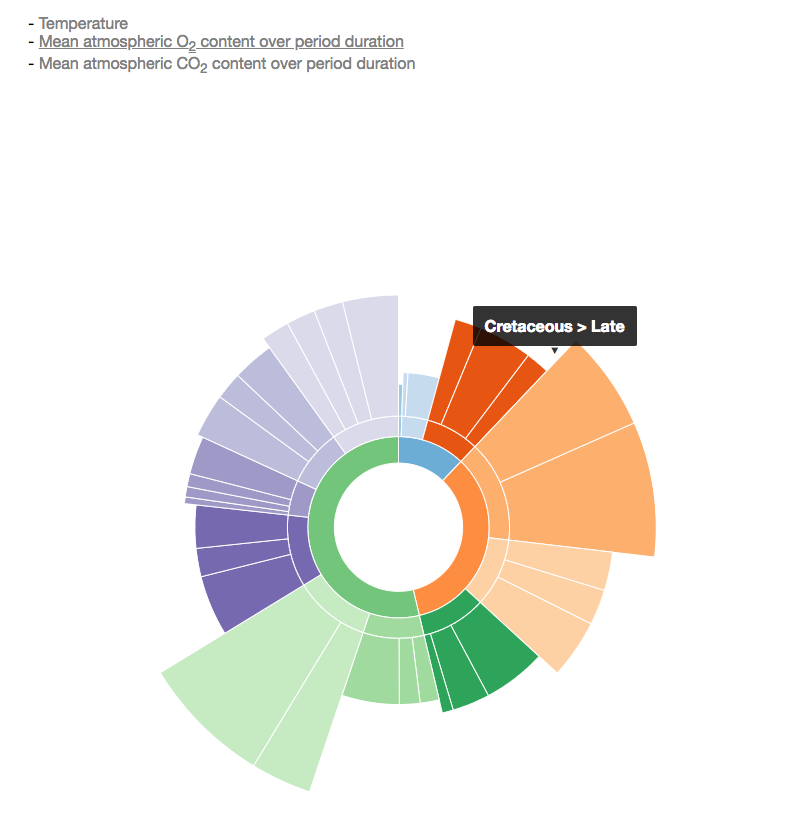

# Chroniko
## An interactive way to explore Earth's history

Purpose: make a graph that is easy to explore the geologic time scale, some definitive events in earth history, and factors that might affect these events (temperature, oxygen, .etc).

### TODOs:
* Add labels to geologic time scale wheel
* Add a new color scheme for GTS
* Add pre-Proterozoic data

## Iteration 1: Sunburst version

<figure>
  
  <figcaption>Iteration 1</figcaption>
</figure>

<figure>
  
  <figcaption>Wikipedia geologic time scale clock</figcaption>
</figure>

I choose sunburst on a whim, seeing [the wikepedia entry of geologic time scale](https://en.wikipedia.org/wiki/Geologic_time_scale) has a similar clock representation of the time scales, along with some definitive events in Earth history. Now I can see several drawbacks of this approach for my  purpose:

* rings are bad representations of values, compared with lines or dots on horizontal or vertical axes. They take up a lot of pixels and thus attention of the viewer. But by differing outer and innder radius the differences are harder to detect, compared with lines/dots.

* Lack of chronological order. This graph is about how we label periods of time, which is oftne metaphorized as a path into physical space1. Sunbursts are good for hierarchical data, but not so good for hiearchical data with an emphasis on order.

* Little room to add more events. Even time scale labels are hard to fit on the rings, not to mention other events such as temperature and oxygen changes, .etc.
